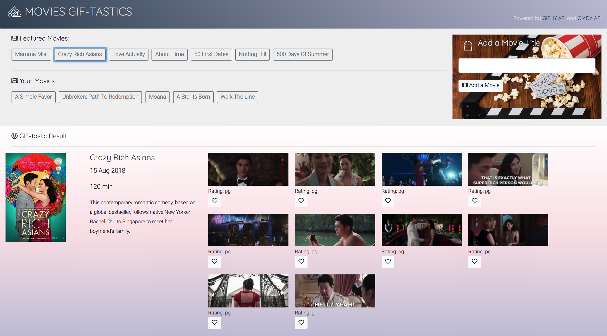
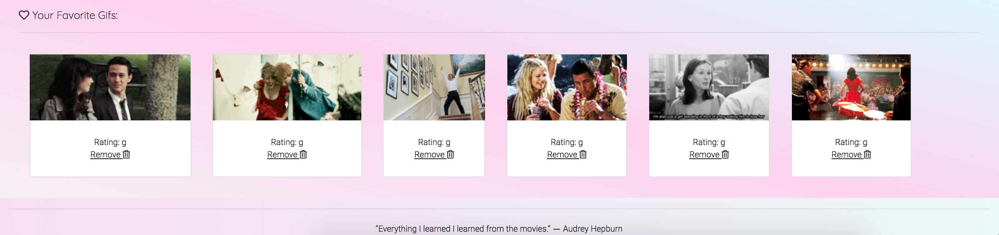

# MOVIES GIF-TASTICS

### Powered by `Giphy API` & `OMDb API`

 [Click to Run the App(https://keenwilson.github.io/giftastic/ "MOVIES GIF-TASTICS")

---
## How This Application Works

* The initial array of movies is created once the page is loaded. The user can add a movie in the textbox. The application will dynamically generate buttons for each movie.
* _Dynamic Elements_: The user triggers gifs to appear related to the movie listed in the button as well as various snippets of information about that movie are displayed underneath. 
* _Pausing Gifs_: The user can stop/start animation by clicking on the gifs

* The user can add gifs to a favorites section that persists even when they select or add a new topic.

---
## Behind the Application

### Front-End:
* Used _Bootstrap_ to create the layout and _Font Awesome_ to add more visual appeal.
* Created click events and registered the submit button. 
* Created working transfers of data between the text-boxes and the backend. 
* Created content regions for where the _Giphy_ and _OMDb_ results will go. 
* Used the `attr` jQuery method to stop/start animation

### Back-End:
* Worked with the _Giphy_ and _OMDb_ APIs. 
* Created the `AJAX` queries with various optional parameters in order to retrieve and parse data in _JSON_ formats. 
* Utilized `jQuery` to show the user Giphy and OMDb results based on their search term.

Integrated the features of GIPHY's search engine and the OMDb (open movie database) into the app by calling the data from GIPHY's API and the OMDb API. Utilized jQuery to show the user Giphy and OMDb results based on their search term and make a dynamic web page that popultes with gifs and snippets of information about the movie of their choice. Used AJAX to update data on a website without having to hit that "refresh" button in the browser. 

---

## Author

[Keen Wilson](https://github.com/keenwilson/keenwilson.github.io "Keen Wilson's Portfolio")

